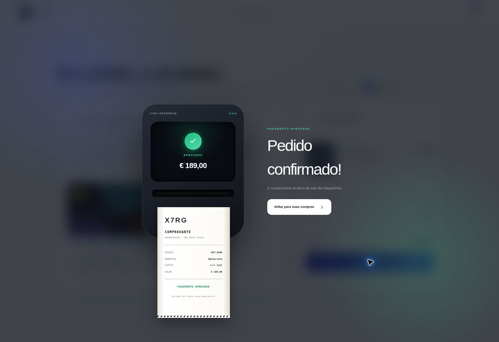

<div align="center">
  

  <h1>Checkout X7RG</h1>

  <p>
    Protótipo educativo de um checkout moderno, responsivo e interativo,<br />
    criado para estudar React, TypeScript, CSS 3D e animações de interface.
  </p>

  <p>
    <a href="https://xx7rg.github.io/checkout-x7rg/"><strong>Abrir demonstração</strong></a>
    ·
    <a href="Manual_Didatico_Checkout_X7RG.docx"><strong>Baixar manual didático</strong></a>
  </p>

  <p>
    
    
    
    
    
  </p>
</div>


> [!IMPORTANT]
> Este projeto é somente uma demonstração visual. Ele não processa pagamentos, não envia dados de cartão e não deve ser usado em produção.

## Sobre o projeto

O **Checkout X7RG** simula a etapa final de uma compra: escolha do método de pagamento, preenchimento visual do cartão, controle de quantidade, aplicação de cupom e confirmação animada. Toda a experiência acontece no navegador, sem integração com bancos ou plataformas de pagamento.

O objetivo é mostrar, de forma prática, como estado, validação, cálculos e animações podem trabalhar juntos em uma interface de e-commerce.

## Principais recursos

| Recurso | Como funciona |
| --- | --- |
| Cartão em tempo real | Número, nome, validade e bandeira são atualizados enquanto o usuário digita. |
| Giro 3D no CVV | Ao focar o código de segurança, o cartão gira e mostra o verso. |
| Bandeira automática | O primeiro número digitado altera a identidade visual do cartão. |
| Métodos de pagamento | Abas demonstrativas para cartão, PayPal e Apple Pay. |
| Carrinho interativo | Quantidade, subtotal, desconto e total são recalculados na tela. |
| Cupom de teste | O código `X7RG007` aplica 10% de desconto. |
| Fluxo animado | A interface passa por processamento, aprovação e impressão do comprovante. |
| Layout responsivo | A composição se adapta a computadores, tablets e celulares. |

## Confirmação animada

Depois da validação, o protótipo apresenta uma maquininha digital e imprime um comprovante sem valor fiscal.



## Fluxo da experiência

1. Escolha entre **Cartão**, **PayPal** ou **Apple Pay**.
2. No cartão, preencha os dados e observe a prévia mudar em tempo real.
3. Clique no campo **CVV** para visualizar o giro 3D.
4. Ajuste a quantidade ou aplique o cupom `X7RG007`.
5. Finalize para acompanhar os estados `idle → processing → approved`.

## Teste rápido

Para explorar as bandeiras no modo demonstrativo, comece o número do cartão com:

| Primeiro número | Bandeira exibida |
| :---: | --- |
| `1` | Visa |
| `2` | Mastercard |
| `3` | American Express |
| `4` | Elo |
| `5` | Hipercard |
| `6` | Discover |
| `7` | JCB |
| `8` | UnionPay |

> Essa associação foi simplificada para fins didáticos. Sistemas reais identificam bandeiras por intervalos BIN/IIN e precisam seguir requisitos de segurança específicos.

## Tecnologias

- **React 19** para componentes e estados da interface;
- **TypeScript** para tipagem e organização da lógica;
- **Vite** no ambiente de desenvolvimento e build;
- **CSS moderno** com Grid, Flexbox, transformações 3D e keyframes.

## Executando localmente

### Pré-requisitos

- Node.js `22.13.0` ou superior;
- npm.

### Instalação

```bash
git clone https://github.com/xx7rg/checkout-x7rg.git
cd checkout-x7rg
npm install
npm run dev
```

Abra no navegador o endereço exibido no terminal, normalmente `http://localhost:5173`.

## Estrutura principal

```text
checkout-x7rg/
├── app/
│   ├── page.tsx          # Interface, estados, validações e cálculos
│   └── globals.css       # Layout, cartão 3D e animações
├── docs/screenshots/     # Imagens utilizadas neste README
├── public/               # Arquivos públicos e identidade visual
├── src/main.tsx          # Entrada da aplicação React
├── .github/workflows/    # Publicação automática no GitHub Pages
├── package.json          # Dependências e comandos
└── vite.config.ts        # Configuração do ambiente Vite
```

## Onde estudar primeiro

1. O array `brands` e as funções de formatação em `app/page.tsx`.
2. Os estados criados com `useState`.
3. As classes `card-scene`, `card-rotator`, `card-front` e `card-back`.
4. A animação `printReceipt` e o componente do comprovante.
5. O cálculo de subtotal, desconto e total.

## Escopo e segurança

- nenhum dado é salvo ou enviado;
- nenhuma transação financeira é realizada;
- PayPal e Apple Pay são apenas representações visuais;
- os números usados nos testes devem ser fictícios;
- o projeto foi criado para estudo, demonstração e portfólio.

---

<div align="center">
  Desenvolvido por <a href="https://github.com/xx7rg"><strong>Rogério Gomes</strong></a> como projeto de estudo e experiência visual.
</div>
